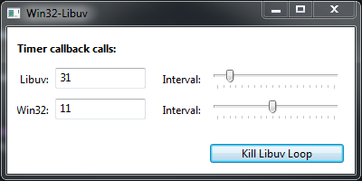

win32-libuv
===========

Example of integrating the [Libuv](https://github.com/libuv/libuv) event loop with the [Win32 API](https://docs.microsoft.com/en-us/windows/win32/) message loop. Based on the Libuv integration with the Chrome message loop in [Electron](https://github.com/electron/electron).

The relevant integration code can be found in:
- [src/main.c](src/main.c)
- [src/win32uv.h](src/win32uv.h)
- [src/win32uv.c](src/win32uv.c)

The other files are just there for the purposes of the demo application:

---

TODO: explain how the integration works